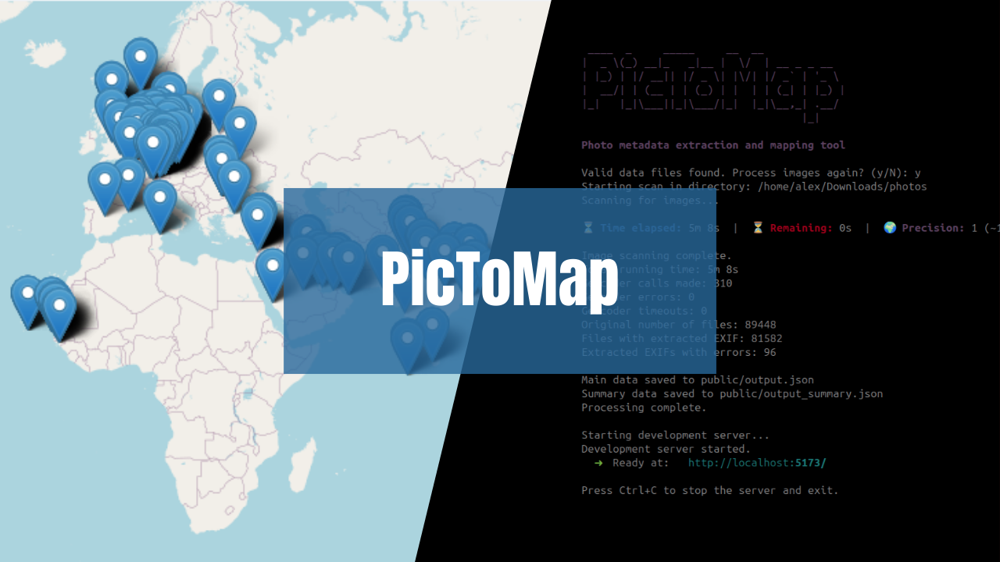

# PicToMap

<p align="center">
  
  
  
  
</p>

<p align="center">
  
</p>

PicToMap is a powerful application that extracts location metadata from your photos and visualises your travels on an interactive map.

This is a personal project born from my passion for exploring the world 🌎 and documenting my journeys through photography 📸. Both the concept and implementation are entirely my own creation, designed to help me keep track of all the amazing places I've visited.

You can also find me on [![LinkedIn][linkedin-shield]][linkedin-url]

## 📷 Features

- **EXIF Data Extraction**: Automatically pulls GPS coordinates, date/time, and other metadata from your photos
- **Geocoding**: Resolves GPS coordinates to city and country names using OpenCage API
- **Interactive Map**: Displays all photo locations on a Leaflet-based map
- **Travel Statistics**: Summarises countries and cities visited with detailed information
- **Local Web Interface**: User-friendly UI that runs in your browser

## 🛠️ Installation

### Prerequisites

- Python 3.7 or higher
- Node.js and npm

### Setup

1. Clone this repository:
   ```
   git clone https://github.com/yourusername/pictomap.git
   cd pictomap
   ```

2. Install Python dependencies:

   **Windows/macOS (if Python 3 is default):**
   ```
   pip install -r requirements.txt
   ```

   **Ubuntu/Linux:**
   ```
   # Create and activate a virtual environment
   python3 -m venv venv
   source venv/bin/activate
   
   # Install dependencies
   pip install -r requirements.txt
   ```

3. Install frontend dependencies:
   ```
   npm install
   ```

4. Create a `.env` file in the root directory with your OpenCage API key:
   ```
   OPENCAGE_API_KEY=your_api_key_here
   ```
   You can obtain a free API key from [OpenCage](https://opencagedata.com/).

## 🚀 Usage

1. Run the application:

   **Windows/macOS (if Python 3 is default):**
   ```
   python main.py
   ```

   **Ubuntu/Linux:**
   ```
   # Ensure your virtual environment is activated
   source venv/bin/activate
   
   # Run the application
   python3 main.py
   ```

2. When prompted, specify whether to process images again or use existing data.

3. The application will:
   - Scan your photos for metadata
   - Extract coordinates and timestamps
   - Resolve locations using the OpenCage API
   - Generate summary statistics
   - Start a local web server

4. Open your browser and navigate to the URL shown in the terminal (typically http://localhost:5173/)

5. Explore your photo locations on the interactive map and review your travel statistics.

## ⚙️ Configuration

In `main.py`, you can modify the directory to scan by changing:
```python
directory = "/path/to/your/photos"
```

## 📦 Dependencies

### Backend
- exifread: Extracts EXIF metadata from images
- opencage: Geocoding service for converting coordinates to location names
- pyfiglet: Creates ASCII art title
- termcolor: Adds colour to terminal output
- python-dotenv: Manages environment variables

### Frontend
- React with TypeScript
- Leaflet (react-leaflet): Interactive mapping
- styled-components: Styling solution

## 📄 Licence

MIT

## 🤝 Contributing

Contributions are welcome! Please feel free to submit a Pull Request.

<!-- MARKDOWN LINKS & IMAGES -->

[linkedin-shield]: https://img.shields.io/badge/-LinkedIn-black.svg?style=for-the-badge&logo=linkedin&colorB=555
[linkedin-url]: https://linkedin.com/in/alexandre-oliv/